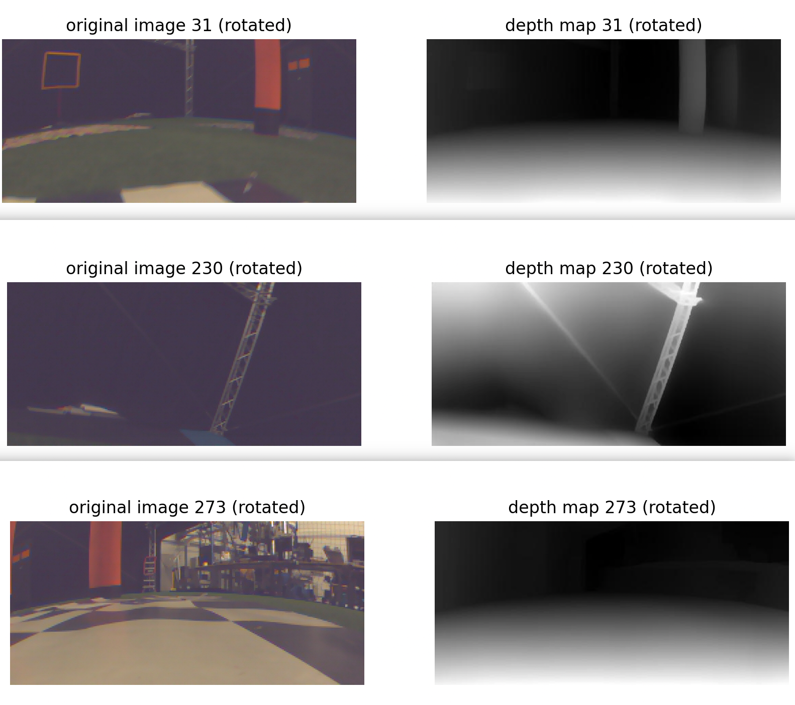
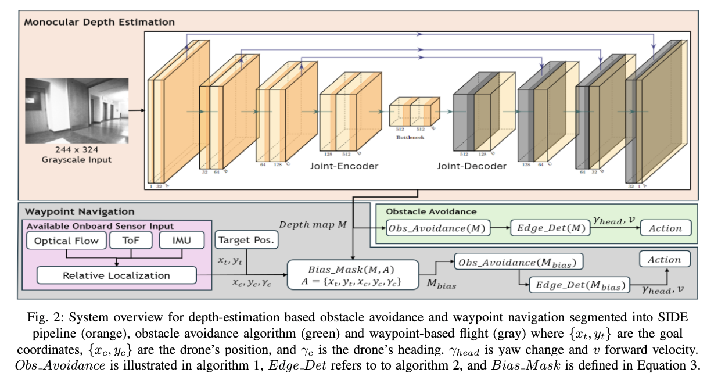

# MAV_depth_estimation

## Usage

### Environment setting

Run the following command to install all the required libraries.

`pip install -r requirements.txt`

### Command-Line Arguments

The code accepts the following command-line arguments:

- mode: Mode of operation. Can be either train or eval.
- checkpoint: Path to the checkpoint file for loading a pre-trained model (optional).

### Running the code

1. Data Prepossing

To convert the raw data from h5 file format to depth tensor, run the following command:

`python main.py --mode data`

2. Training

To train the model, use the following command:

`python main.py --mode train`

You can optionally specify a checkpoint file to resume training from a saved state:

`python main.py --mode train --checkpoint path/to/checkpoint.pth`

3. Evaluation

To evaluate the model, use the following command:

`python main.py --mode eval --checkpoint path/to/checkpoint.pth`

4. Simple test by loading image & depth map comparison

To simply load a random pair of image and depth map for comparison, use the following command:

`python main.py`

## Lemon's Note

The TODO.txt in the folders are just for getting the empty directory to be tracked. If you have added something inside the empty folder, just delete it. 

**TODO:**

1. **Data augmentation** -> focus on random clip & rotation, etc
2.  **Compare between MobielNet v1 & MobielNet v3 to see if we can furthur improve the data**
3. **Use out-of-scene data for regularion** -> To improve model's generalization ability

### Optimization

1. decrease the input size
2. just make it compatible with the flying speed -> 10fps is enough

## Dataset 

Using the [DepthAnything](https://github.com/LiheYoung/Depth-Anything?tab=readme-ov-file) Model, we successfully generated training data pair as <original_image, depth_map>, as illustrated below.

However, from the samples we can also tell that even the largest model in DepthAnything cannot guarantee a stable depth estimation. For example, in image 31, the orange pole on the right is detetced while the orange square on the left is still hidden. Similarly, in image 273, we can tell there's a orange pole in the left corner, however in depth map it is not demonstrated. 

## Model Structure

The model is inherited and modified from the paper [Monocular Depth Estimation for Drone Obstacle Avoidance in Indoor
Environments](https://www-video.eecs.berkeley.edu/papers/Drone_Paper_V_Final.pdf). 

These're the modificaitons I have made to adjust our tasks:

1. Concat the original image and depth map in the first dimension as "rgb+d" tensor to serve as the input.

2. Ignore the 5-layer Joint encoder and decoder since I don't know how exactly the 5 layers are connected and that may even double the model size. Given our limited cpu and memory, I opt to use a 2-layer connection.

3. For the last three layer representively in encoder and decoder, I directly implemented residual cnnection to aid in construction without using the upscale algorithm talked in the paper.